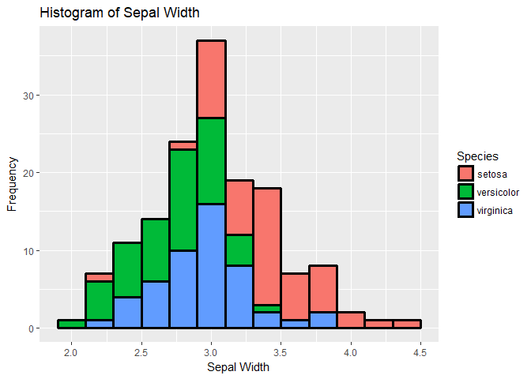
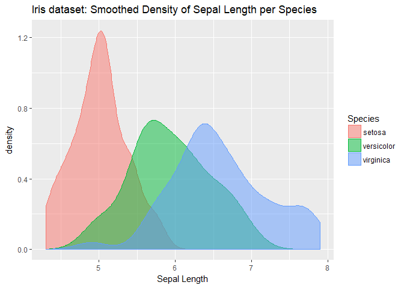
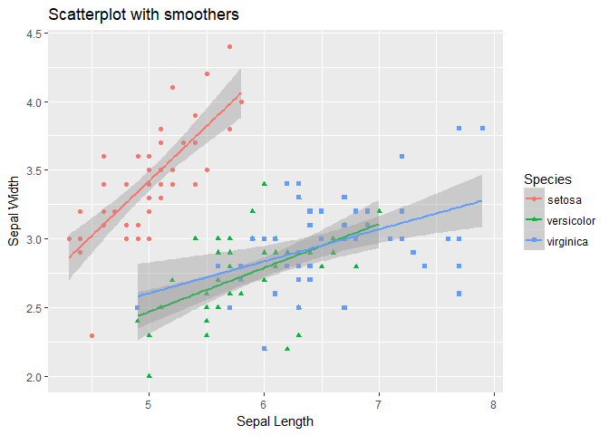
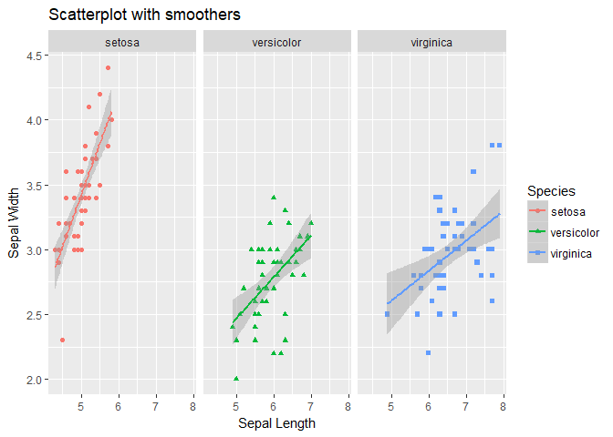
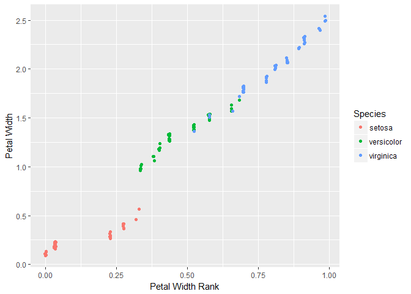

DataViz\_ex1
================
Kasparek
1 listopadu 2017

R Markdown
----------

This is an R Markdown document containing the exercises for Week 1 of course Machine Learning for Econometrics.

    ##   Sepal.Length    Sepal.Width     Petal.Length    Petal.Width   
    ##  Min.   :4.900   Min.   :2.200   Min.   :4.500   Min.   :1.400  
    ##  1st Qu.:6.225   1st Qu.:2.800   1st Qu.:5.100   1st Qu.:1.800  
    ##  Median :6.500   Median :3.000   Median :5.550   Median :2.000  
    ##  Mean   :6.588   Mean   :2.974   Mean   :5.552   Mean   :2.026  
    ##  3rd Qu.:6.900   3rd Qu.:3.175   3rd Qu.:5.875   3rd Qu.:2.300  
    ##  Max.   :7.900   Max.   :3.800   Max.   :6.900   Max.   :2.500  
    ##        Species  
    ##  setosa    : 0  
    ##  versicolor: 0  
    ##  virginica :50  
    ##                 
    ##                 
    ## 

    ##   Petal.Length    Petal.Width   
    ##  Min.   :1.000   Min.   :0.100  
    ##  1st Qu.:1.600   1st Qu.:0.300  
    ##  Median :4.350   Median :1.300  
    ##  Mean   :3.758   Mean   :1.199  
    ##  3rd Qu.:5.100   3rd Qu.:1.800  
    ##  Max.   :6.900   Max.   :2.500

